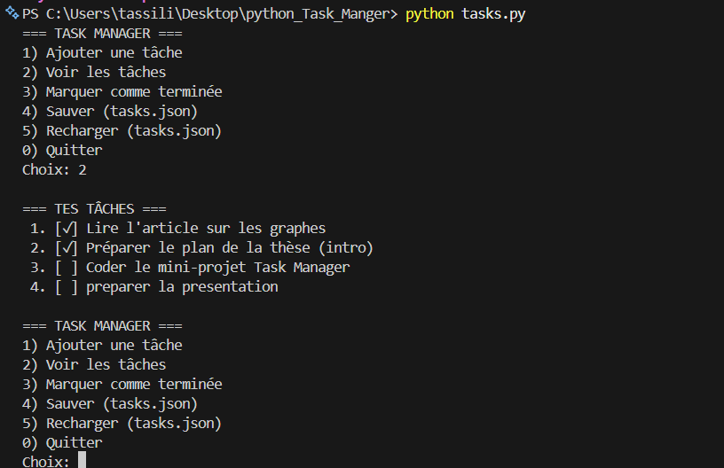

# Task Manager CLI

Mini projet : **gestion de tâches en ligne de commande** avec persistance **JSON** (fichier `tasks.json`).  
Checklist (extrait) : **3+ commits Git**, **Flake8 sans erreurs**, **README avec instructions**, **capture d’écran de l’app en exécution** 

## Fonctionnalités
- Ajouter une nouvelle tâche
- Afficher toutes les tâches
- Marquer une tâche comme terminée
- Sauvegarder automatiquement dans `tasks.json`
- Recharger les tâches depuis `tasks.json`

## Prérequis
- Python **3.8+** (recommandé)

## Installation
```bash
git clone <URL_DU_REPO>
cd <NOM_DU_DOSSIER>
```
## Installation
```bash
python3 tasks.py
```
## Utilisation (exemple)
Au lancement, un menu s’affiche. Exemple de scénario :

- Ajouter une tâche (ex : “Réviser le cours de Python”)
- Voir les tâches
- Marquer une tâche comme terminée
- Quitter
Les données sont enregistrées dans tasks.json.

Fichier de sauvegarde (tasks.json)
Format attendu :
```bash
[
  { "title": "Lire l'article sur les graphes", "done": false },
  { "title": "Préparer le plan de la thèse (intro)", "done": true }
]
```
## Qualité de code (Flake8)
Vérifier qu’il n’y a aucune erreur :
```bash
flake8 tasks.py
```

## Capture d’écran

